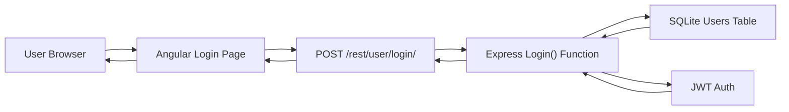
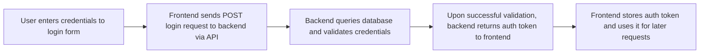
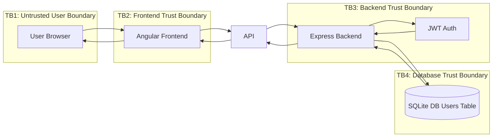
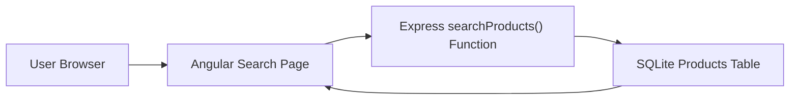
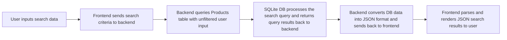
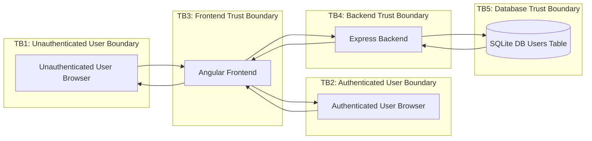

# Threat Modeling of OWASP Juice Shop

The purpose of this project is to do a simulated threat modeling of the popular, intentionally vulnerable web app OWASP Juice Shop. We will focus on assessing 2 core features of the application:

1. The login authentication flow
2. The product search feature

For each feature, we will do the following:

1. Create a System Architecture Overview
2. Outline a Data Flow Diagram
3. Create a Trust Boundary Diagram
4. Outline a risk register and analyze using STRIDE model
5. Conduct a gap analysis
6. Map risks to ISO 27001 and NIST SP 800-53 controls

Let's get started!

## Table of Contents
* [Login Authentication](#auth)
* [Product Search](#search)

## 1. Login Authentication Threat Model

### Objective
Assess the authentication feature for security risks related to credential submission, token issuance, session trust, and authorization dependencies.

### Scope
- Login submission
- Backend credential validation
- Token issuance and return to client
- Authentication-related trust boundaries

### Process
- Architecture overview
- Data flow diagram
- Trust boundary diagram
- STRIDE analysis
- Gap analysis
- Risk register
- NIST / ISO mapping

### 1.1 Architecture Overview

### 1.2 Data Flow Diagram

### 1.3 Trust Boundary Diagram

### 1.4 Risk Register

| Risk ID | Risk | STRIDE | Likelihood | Impact | Mitigation |
|---|---|---|---|---|---|
| AUTH-01 | Brute force login | Spoofing | High | High | Rate limiting, account lockout policy, MFA |
| AUTH-02 | JWT Token forgery | Tampering | Medium | Critical | Signature verification, strict token validation |
| AUTH-03 | No login audit logs | Repudiation | Medium | Medium | Implement auth logging |
| AUTH-04 | Verbose login error responses | Information Disclosure | Medium | Medium | Generic error messages |
| AUTH-05 | SQL Injection | Elevation of Privilege / Spoofing | High | Critical | WAF, parameterized queries, input sanitization |

### 1.5 Gap Analysis

| Risk ID | Risk | Expected Control | Status | Gap | Impact | Recommended Remediation |
|---|---|---|---|---|---|---|
| AUTH-01 | Brute force login | Brute force login protection | Not evident | Rate limiting on login attempts does not seem to be present within the scope. | Increases the likelihood of user impersonation, which may lead to complete account compromise and sensitive information disclosure. | Lockout policy on failed login attempts and enforcing strong password policy upon account creation. | 
| AUTH-02 | JWT Token forgery | Token signing | Present within scope | Auth tokens should be signed to prevent tampering or impersonation. | Absence of token signing may allow attackers to craft or modify their own token to elevate privileges or impersonate another user. | Implement token signing and validation. |
| AUTH-03 | No login audit logs | Logging login activity | Not evident | Auditing login attempts does not seem evident within the scope. | Increases likelihood of repudiation without audit logs. | Securely store logs on web server log files. | 
| AUTH-04 | Verbose login error responses | Generic error messages upon failed login | Requires validation | Generic error messages should be given for all failed login cases to prevent attackers from enumerating valid users from them. | Increases the likelihood of user enumeration, which may be later used for further attacks. | Implement generic error messages for all login errors. | 
| AUTH-05 | SQL Injection | Backend uses parameterized queries to query database | Not evident | the `login()` function does not utilize parameterized queries | SQL Injection may lead to the disclosure of sensitive information or in severe cases, bypassing authentication or remote code execution. | Parameterized queries should be implemented when querying the database. Also doing input santization on user input is highly recommended. |

### 1.6 Compliance Mapping

| Risk ID | Risk | NIST SP 800-53 | ISO 27001 |
|---|---|---|---|
| AUTH-01 | Brute-force / credential stuffing | AC-7, IA-2 | A.9 |
| AUTH-02 | JWT Token forgery | IA-5, SC-23 | A.10, A.9 |
| AUTH-03 | Incomplete login audit trail | AU-2, AU-12 | A.12.4 |
| AUTH-04 | Verbose login error responses | SI-11 | A.14 |
| AUTH-05 | SQL Injection | SI-10, SI-15 | A.8.25, A.8.26 |

--------------

## 2. Product Search Threat Model

### Objective
Assess the product search and catalog discovery feature for risks related to user-controlled input, data retrieval, query handling, and result output.

### Scope
- Search term input submission
- Backend search processing and input handling
- Product lookup and result rendering

### Process
- Architecture overview
- Data flow diagram
- Trust boundary diagram
- STRIDE analysis
- Gap analysis
- Risk register
- NIST / ISO mapping

### 2.1 Architecture Overview

### 2.2 Data Flow Diagram

### 2.3 Trust Boundary Diagram

### 2.4 Risk Register

| Risk ID | Risk | STRIDE | Likelihood | Impact | Mitigation |
|---|---|---|---|---|---|
| SEARCH-01 | SQL Injection - Product Data Exposure | Information Disclosure | High | Medium | Implement WAF, sanitize input, and implement parameterized queries. |
| SEARCH-02 | SQL Injection - User Data Enumeration | Information Disclosure, Spoofing, Escalation of Privileges | High | Critical | Implement WAF, sanitize input, and implement parameterized queries. | 
| SEARCH-03 | Unauthenticated users can search products | Repudiation | High | Low |  Allow only authenticated users to search or set user tracking cookie. |
| SEARCH-04 | Expensive or excessive search queries | DoS | High | High | Block suspicious IP and limit search query rates. |

### 2.5 Gap Analysis

| Risk ID | Risk | Expected Control | Status | Gap | Impact | Recommended Remediation |
|---|---|---|---|---|---|---|
| SEARCH-01 | SQL Injection - Product Data Exposure | Input sanitization and parameterized queries | Not evident | No evidence of input sanitization or parameterized query usage found in code base for scope | A malicious actor can read and possibly modify unauthorized product data in database | Sanitize user search input and query database using parameterized queries |
| SEARCH-02 | SQL Injection - User Data Enumeration | Input sanitization and parameterized queries | Not evident | No evidence of input sanitization or parameterized query usage found in code base for scope | A malicious actor can read data from Users table and possibly even retrieve their PII and credentials | Sanitize user search input and query database using parameterized queries |
| SEARCH-03 | Unauthenticated users can search products | Allow only authenticated users to search or set user tracking cookie | Not evident | Not evident in scope | Increases likelihood of repudiation and anonymous activity that can not be tracked | Hide search feature for authenticated users only or audit all user activity in a secure location |
| SEARCH-04 | Expensive or excessive search queries | Implement WAF or rate limiting. Blacklist DoS IPs | Not evident | Expected controls not evident in scope | A malicious actor may flood the application with search requests. This may lead to slower performance of the web application and database, which in severe cases, may cause shutdown of the application | Implementing a WAF may help blacklist DoSing IP addresses and limiting excessive traffic |

### 2.6 Compliance Mapping

| Risk ID | Risk | NIST SP 800-53 | ISO 27001 |
|---|---|---|---|
| SEARCH-01 | SQL Injection - Product Data Exposure | SI-10, SI-15 | A.8.25, A.8.26 |
| SEARCH-02 | SQL Injection - User Data Enumeration | SI-10, SI-15 | A.8.25, A.8.26 |
| SEARCH-03 | Unauthenticated users can search products | SC-5 | A.8.15, A.8.16, A.8.24 |
| SEARCH-04 | Expensive or excessive search queries | AU-10 | A.8.14, A.8.20 |

