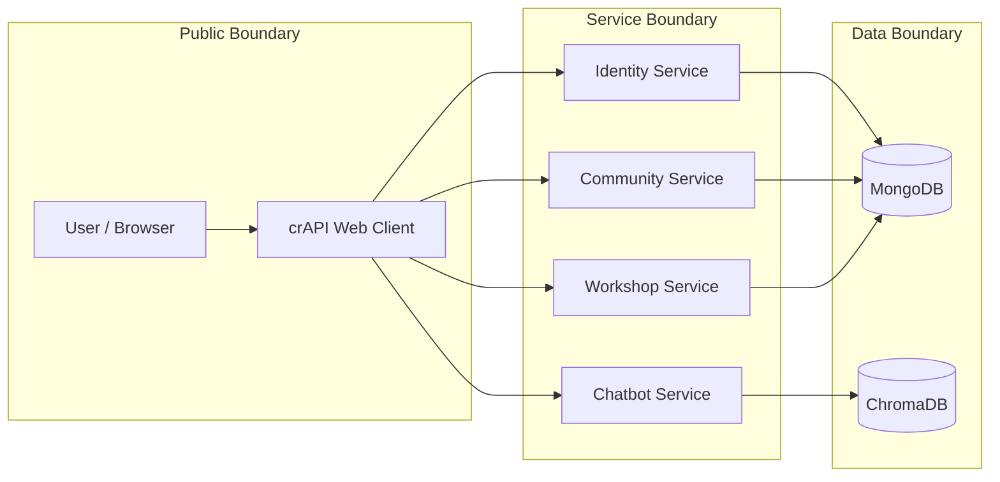
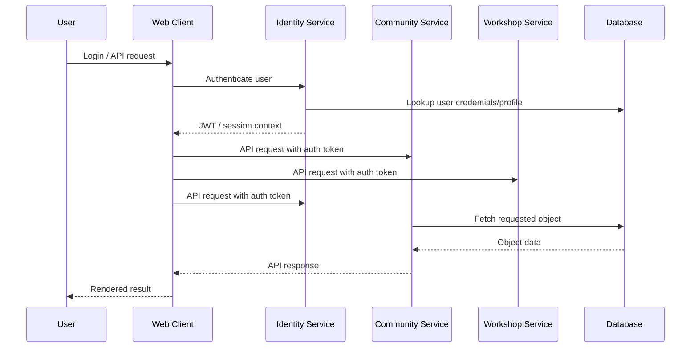

# Securing crAPI: API Security Risk Assessment & Remediation

**End-to-end API security assessment of OWASP crAPI focused on broken object-level authorization, authentication weaknesses, excessive data exposure, and secure code remediation.**

## Executive Summary

This project demonstrates how I would approach a real API security assessment as an Application Security Engineer. I reviewed crAPI's microservice architecture, modeled trust boundaries, identified high-impact OWASP API Top 10 risks, validated exploitability with evidence of vulnerability, and implemented code-level remediations.

The project focuses on practical API risks that matter in real companies:

- Can users access another user's objects?
- Are JWTs validated correctly?
- Do API responses expose sensitive fields unnecessarily?
- Are admin or privileged functions protected server-side?
- Are fixes implemented at the correct trust boundary?

## Security Skills Demonstrated

| Area | Evidence |
|---|---|
| API Security | BOLA/IDOR, excessive data exposure, broken authentication |
| Threat Modeling | STRIDE, DFDs, trust boundaries, service/data flow mapping |
| Secure Code Review | Java/Spring service-layer review and authorization logic analysis |
| Remediation Design | Ownership checks, separate models for public and private use, auth validation improvements |
| Risk Communication | Findings grouped by OWASP API Top 10 impact and remediation priority |
| Engineering Judgment | Focused on root causes instead of superficial scanner output |

## Application Architecture

crAPI is a deliberately vulnerable microservice API application. The assessment focused on user-facing API flows and backend service authorization decisions.


```

## Data Flow Reviewed



Some security questions considered for each data flow:

- Is identity established server-side?
- Is authorization checked against the resource owner?
- Is the API returning only the fields the client needs?
- Can request parameters override authorization decisions?
- Are administrative actions protected by role checks?

## Threat Modeling (STRIDE)
| Category        | Example in crAPI                        |
| --------------- | --------------------------------------- |
| Spoofing        | JWT Token Forgery [CR02]                |
| Tampering       | Improper JWT Token Validation [CR02]    |
| Repudiation     | Lack of logging                         |
| Info Disclosure | Excessive data exposure [CR03]          |
| DoS             | No rate limiting                        |
| Elevation       | Broken function-level auth (BOLA) [CR04]|

## Key Findings & Remediation Strategy

### Finding 1: Broken Object-Level Authorization

**OWASP API Category:** API1 — Broken Object Level Authorization  
**Severity:** Critical/High  
**Root cause:** Object identifiers were accepted from client requests without consistently verifying ownership server-side.

#### Impact

A user could potentially access or manipulate resources belonging to another user by changing an object ID in the request.

#### Vulnerable Pattern

```java
vehicleDetailsRepository.findByUuid(carId);
```

This pattern trusts the object identifier but does not prove the authenticated user owns the object.

#### Secure Pattern

```java
vehicleDetails = vehicleDetailsRepository.findByUuidAndOwner_id(carId, currentUserId);
if (vehicleDetails != null && vehicleDetails.getOwner() != null) {
    userDetails = userDetailsRepository.findByUser_id(currentUserId);
```

#### Why This Works

Authorization is enforced at the data access boundary. The query only returns the object if the object ID and authenticated user ownership both match.

---

### Finding 2: Broken Authentication / JWT Validation Weaknesses

**OWASP API Category:** API2 — Broken Authentication  
**Severity:** High  
**Root cause:** Authentication logic relied on token parsing/claims without consistently enforcing signature validation, algorithm expectations, and token trust boundaries.

#### Remediation Principles

- Validate JWT signatures before trusting claims.
- Reject unsigned or unexpected algorithms.
- Enforce secure whitelisted algorithm.
- Keep token parsing and token trust decisions separate.
- Add negative tests for tampered, expired, unsigned, and wrong-algorithm tokens.

#### Vulnerable Code Pattern

```java
// Parse without verifying token signature
return JWTParser.parse(token).getJWTClaimsSet().getSubject();
```

#### Secure Validation Pattern

```java
// Validate token before parsing claims
SignedJWT signedJWT = SignedJWT.parse(token);

if (!validateJwtToken(token)) {
    throw new ParseException("Invalid JWT token", 0);
}
return signedJWT.getJWTClaimsSet().getSubject();
```

```java
// Reject unsigned or unexpected algorithms and enforce RS256 algorithm
try {
    SignedJWT signedJWT = SignedJWT.parse(authToken);
    JWSHeader header = signedJWT.getHeader();
    Algorithm alg = header.getAlgorithm();
    boolean valid = false;
 
    if (alg == null || !Objects.equals(alg.getName(), "RS256")) {
        throw new JOSEException("Invalid JWT algorithm. Expected RS256.");
    } else {
        RSASSAVerifier verifier = new RSASSAVerifier(this.publicRSAKey);
        valid = signedJWT.verify(verifier);
        return valid;
    }
} catch (ParseException | JOSEException e) {
    log.error("JWT verification failed. Token rejected. Message: %d", e);
}
```

---

### Finding 3: Excessive Data Exposure

**OWASP API Category:** API3 — Broken Object Property Level Authorization  
**Severity:** High  
**Root cause:** API responses exposed internal or sensitive user fields instead of using purpose-built models.

#### Impact

Attackers could harvest sensitive information such as internal identifiers, emails, or vehicle-related data from endpoints where that data is not required.

#### Remediation

Create a public Author model that excludes sensitive information and change the Post model to use it instead of the private Author model.

```go
type PostAuthor struct {
	Nickname string `bson:"nickname" json:"nickname"`
	Picurl   string `bson:"profile_pic_url" json:"profile_pic_url"`
}
```

```go
type Post struct {
	ID        string     `gorm:"primary_key;auto_increment" json:"id"`
	Title     string     `gorm:"size:255;not null;unique" json:"title"`
	Content   string     `gorm:"size:255;not null;" json:"content"`
	Author    PostAuthor     `bson:"author" json:"author"`
	Comments  []Comments `json:"comments"`
	AuthorID  uint64     `sql:"type:int REFERENCES users(id)" json:"authorid"`
	CreatedAt time.Time
}
```

Avoid returning sensitive information on public pages.

#### Why This Works

Creating a separate model for public use hides sensitive information while minimizing changes to the codebase.

---

### Finding 4: Broken Function-Level Authorization

**OWASP API Category:** API5 — Broken Function Level Authorization  
**Severity:** High  
**Root cause:** Privileged behavior depended on insufficient role checks or client-reachable paths.

#### Vulnerable Code

```java
User user = userService.getUserFromToken(request);
if (optionalProfileVideo.isPresent()) {
    profileVideo = optionalProfileVideo.get();
    profileVideo.setUser(null);
    profileVideoRepository.delete(profileVideo);
    return new CRAPIResponse(UserMessage.VIDEO_DELETED_SUCCESS_MESSAGE, 200);
}
```

#### Remediation

Add server-side role enforcement near sensitive functions.

```java
User user = userService.getUserFromToken(request); // validates token while getting username
ERole role = user.getRole(); // get user role to check requesting user access
if (optionalProfileVideo.isPresent() && role == ERole.ROLE_ADMIN) {
    profileVideo = optionalProfileVideo.get();
    profileVideo.setUser(null);
    profileVideoRepository.delete(profileVideo);
    return new CRAPIResponse(UserMessage.VIDEO_DELETED_SUCCESS_MESSAGE, 200);
}
```

#### Why This Works

Authorization must be enforced server-side, close to the privileged operation. UI hiding does not count as authorization.

## Remediation Priority

| Priority | Risk | Why It Matters |
|---|---|---|
| P0 | JWT validation weakness | Can undermine all downstream authorization |
| P1 | BOLA / IDOR | Direct unauthorized access to other users' data |
| P2 | Excessive data exposure | Leaks sensitive fields at scale |
| P3 | Function-level auth gaps | Enables privilege abuse if endpoints are reachable |

## What This Project Proves

This project shows I understand API security as an engineering discipline, not just as a checklist. The core theme is enforcing authorization at the right layer, validating identity before trusting claims, and minimizing sensitive data exposure through intentional API design.

