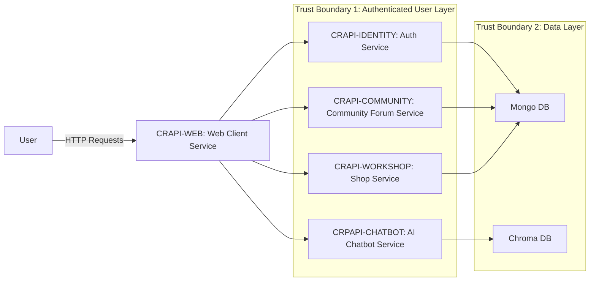
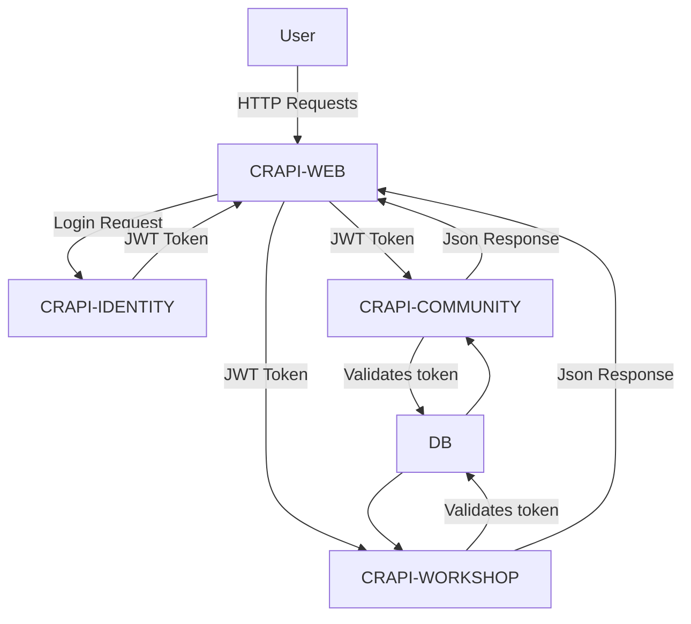
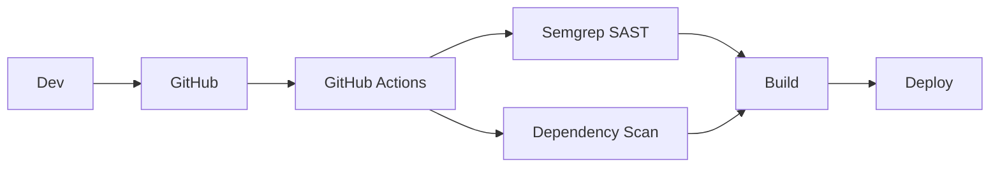

# Securing crAPI: AppSec Risk Assessment & Remediation

**Threat modeling, API exploitation, and secure fixes aligned to the OWASP API Top 10.**

---

## 📌 Overview

End-to-end application security assessment of crAPI, simulating how a real AppSec engineer identifies, exploits, and remediates API vulnerabilities across a secure SDLC.

---

## 🏗️ Architecture Overview

## 🔄 Data Flow (DFD)

## ⚠️ Threat Modeling (STRIDE)
| Category        | Example in crAPI                      |
| --------------- | ------------------------------------- |
| Spoofing        | JWT Token Forgery [CR02]              |
| Tampering       | Improper JWT Token Validation [CR02]  |
| Repudiation     | Lack of logging                       |
| Info Disclosure | Excessive data exposure [CR03]        |
| DoS             | No rate limiting                      |
| Elevation       | Broken object-level auth (BOLA) [CR04]|

## 🔍 Key Vulnerabilities
- Broken Object Level Authorization (BOLA)
- Broken Authentication
- Excessive Data Exposure
- Improper Access Control on Function

## 🔐 Remediation Highlights
- Check data ownership → IDOR prevention
- JWT token validation → Fix broken authentication
- Create separate public user model → Hide sensitive data
- Improved authentication controls → Implement authorized access to admin functions

## 🔁 DevSecOps Integration

## 📊 Impact
- Mitigated the Top 4 of OWASP API Top 10 risks
- Shifted security left (CI/CD)
- Improved resilience against real-world API attacks
