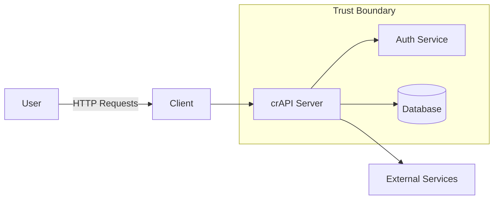

# Securing crAPI: AppSec Risk Assessment & Remediation

**Threat modeling, API exploitation, and secure fixes aligned to the OWASP API Top 10.**

---

## 📌 Overview

End-to-end application security assessment of crAPI, simulating how a real AppSec engineer identifies, exploits, and remediates API vulnerabilities across a secure SDLC.

---

## 🏗️ Architecture Overview



## 🔄 Data Flow (DFD)
```flowchart TD
    U[User] -->|Login Request| A[API Endpoint]
    A -->|Validate Credentials| Auth
    Auth -->|Token| A
    A -->|Fetch Data| DB
    DB -->|Response| A
    A -->|JSON Response| U
```

## ⚠️ Threat Modeling (STRIDE)
| Category        | Example in crAPI                |
| --------------- | ------------------------------- |
| Spoofing        | Weak authentication             |
| Tampering       | Unsanitized input               |
| Repudiation     | Lack of logging                 |
| Info Disclosure | Excessive data exposure         |
| DoS             | No rate limiting                |
| Elevation       | Broken object-level auth (BOLA) |

## 🔍 Key Vulnerabilities
- Broken Object Level Authorization (BOLA)
- Broken Authentication
- Injection (SQL/NoSQL)
- Excessive Data Exposure
- No Rate Limiting

## 🔐 Remediation Highlights
- Parameterized queries → prevent injection
- Authorization checks → fix BOLA
- Input validation & sanitization
- Rate limiting (IP + account-based)
- Improved authentication controls


## 🔁 DevSecOps Integration

```
flowchart LR
    Dev --> GitHub
    GitHub --> CI[GitHub Actions]
    CI --> SAST[Semgrep SAST]
    CI --> SCA[Dependency Scan]
    CI --> Build
    Build --> Deploy
```

## 📊 Impact
- Reduced OWASP API Top 10 risks
- Shifted security left (CI/CD)
- Improved resilience against real-world API attacks