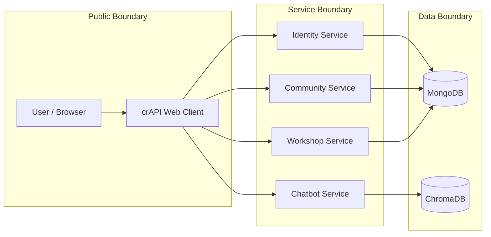
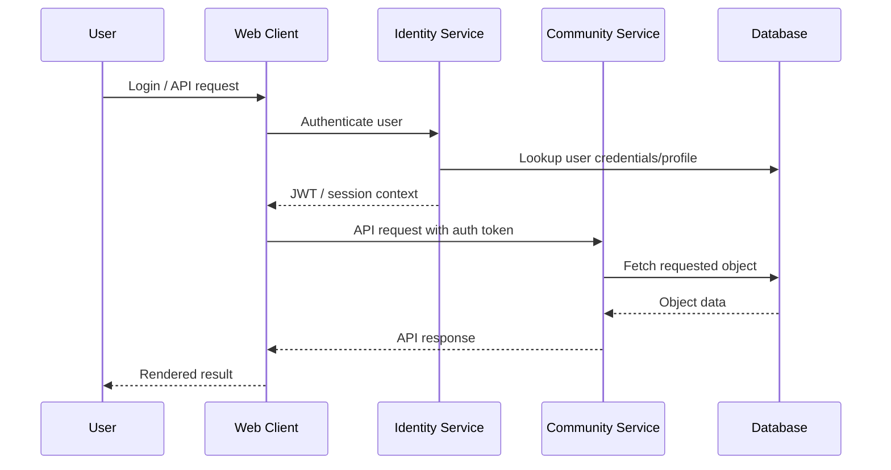

# Securing crAPI: API Security Risk Assessment & Remediation

**End-to-end API security assessment of OWASP crAPI focused on broken object-level authorization, authentication weaknesses, excessive data exposure, and secure code remediation.**

## Executive Summary

This project demonstrates how I would approach a real API security assessment as an Application Security Engineer. I reviewed crAPI's microservice architecture, modeled trust boundaries, identified high-impact OWASP API Top 10 risks, validated exploitability, and proposed or implemented code-level remediations.

The project focuses on practical API risks that matter in real companies:

- Can users access another user's objects?
- Are JWTs validated correctly?
- Do API responses expose sensitive fields unnecessarily?
- Are admin or privileged functions protected server-side?
- Are fixes implemented at the correct trust boundary?

## Security Skills Demonstrated

| Area | Evidence |
|---|---|
| API Security | BOLA/IDOR, excessive data exposure, broken authentication |
| Threat Modeling | STRIDE, DFDs, trust boundaries, service/data flow mapping |
| Secure Code Review | Java/Spring service-layer review and authorization logic analysis |
| Remediation Design | Ownership checks, DTO response shaping, auth validation improvements |
| Risk Communication | Findings grouped by OWASP API Top 10 impact and remediation priority |
| Engineering Judgment | Focused on root causes instead of superficial scanner output |

## Application Architecture

crAPI is a deliberately vulnerable microservice API application. The assessment focused on user-facing API flows and backend service authorization decisions.



## Data Flow Reviewed



Security questions applied to each flow:

- Is identity established server-side?
- Is authorization checked against the resource owner?
- Is the API returning only the fields the client needs?
- Can request parameters override authorization decisions?
- Are administrative actions protected by role checks?

## Key Findings & Remediation Strategy

### Finding 1: Broken Object-Level Authorization

**OWASP API Category:** API1 — Broken Object Level Authorization  
**Severity:** Critical/High  
**Root cause:** Object identifiers were accepted from client requests without consistently verifying ownership server-side.

#### Impact

A user could potentially access or manipulate resources belonging to another user by changing an object ID in the request.

#### Vulnerable Pattern

```java
vehicleDetailsRepository.findByUuid(carId);
```

This pattern trusts the object identifier but does not prove the authenticated user owns the object.

#### Secure Pattern

```java
User user = userService.getUserFromToken(request);
VehicleDetails vehicleDetails = vehicleDetailsRepository.findByUuidAndOwner_id(carId, user.getId());

if (vehicleDetails == null) {
    throw new EntityNotFoundException("Vehicle not found for authenticated user");
}
```

#### Why This Works

Authorization is enforced at the data access boundary. The query only returns the object if the object ID and authenticated user ownership both match.

---

### Finding 2: Excessive Data Exposure

**OWASP API Category:** API3 — Broken Object Property Level Authorization  
**Severity:** High  
**Root cause:** API responses exposed internal or sensitive user fields instead of using purpose-built response models.

#### Impact

Attackers could harvest sensitive information such as internal identifiers, emails, or vehicle-related data from endpoints where that data is not required.

#### Remediation

Use explicit DTOs / public response models.

```java
public class PublicUserResponse {
    private Long id;
    private String username;
    private String displayName;
}
```

Avoid returning full ORM/entity objects directly from API controllers.

#### Why This Works

DTOs enforce response minimization. The API contract defines what should leave the service, instead of accidentally serializing internal fields.

---

### Finding 3: Broken Authentication / JWT Validation Weaknesses

**OWASP API Category:** API2 — Broken Authentication  
**Severity:** High  
**Root cause:** Authentication logic relied on token parsing/claims without consistently enforcing signature validation, algorithm expectations, and token trust boundaries.

#### Remediation Principles

- Validate JWT signatures before trusting claims.
- Reject unsigned or unexpected algorithms.
- Enforce expected issuer/audience where applicable.
- Keep token parsing and token trust decisions separate.
- Add negative tests for tampered, expired, unsigned, and wrong-algorithm tokens.

#### Secure Validation Pattern

```java
SignedJWT signedJWT = SignedJWT.parse(token);
JWSAlgorithm alg = signedJWT.getHeader().getAlgorithm();

if (!JWSAlgorithm.RS256.equals(alg)) {
    throw new SecurityException("Unexpected JWT algorithm");
}

if (!signedJWT.verify(verifier)) {
    throw new SecurityException("Invalid JWT signature");
}
```

---

### Finding 4: Broken Function-Level Authorization

**OWASP API Category:** API5 — Broken Function Level Authorization  
**Severity:** High  
**Root cause:** Privileged behavior depended on insufficient role checks or client-reachable paths.

#### Remediation

Add server-side role enforcement near sensitive functions.

```java
if (!ERole.ROLE_ADMIN.equals(user.getRole())) {
    throw new AccessDeniedException("Admin role required");
}
```

#### Why This Works

Authorization must be enforced server-side, close to the privileged operation. UI hiding is not authorization.

## Remediation Priority

| Priority | Risk | Why It Matters |
|---|---|---|
| P0 | BOLA / IDOR | Direct unauthorized access to other users' data |
| P1 | JWT validation weakness | Can undermine all downstream authorization |
| P1 | Excessive data exposure | Leaks sensitive fields at scale |
| P2 | Function-level auth gaps | Enables privilege abuse if endpoints are reachable |

## What This Project Proves

This project shows I understand API security as an engineering discipline, not just as a checklist. The core theme is enforcing authorization at the right layer, validating identity before trusting claims, and minimizing sensitive data exposure through intentional API design.

## Recommended Evidence to Include

To make this stronger for reviewers, include:

```text
evidence/
├── requests/
│   ├── bola-before.http
│   └── bola-after.http
├── screenshots/
│   ├── unauthorized-object-access-before.png
│   └── unauthorized-object-access-after.png
├── tests/
│   ├── jwt-tampering-negative-test.md
│   └── object-ownership-test.md
└── code-diffs/
    ├── getVehicleLocation-before-after.md
    └── response-dto-before-after.md
```

## Future Improvements

- Add unit/integration tests proving object ownership enforcement.
- Add negative JWT validation tests.
- Add OpenAPI security documentation for protected endpoints.
- Add API gateway/rate limiting design notes.
- Add Semgrep rules for missing ownership checks in repository/service methods.
