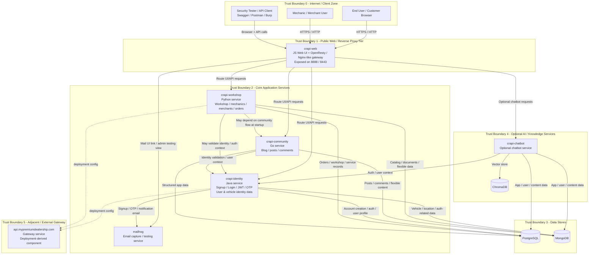
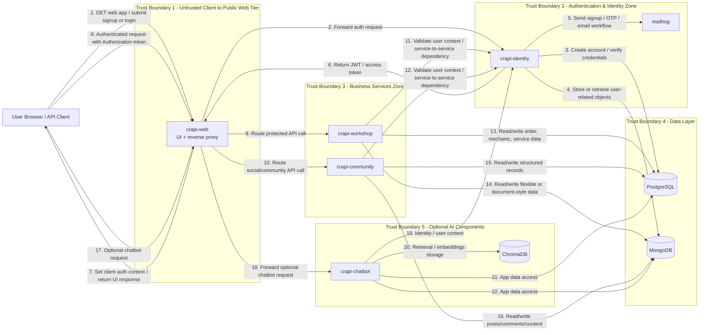

# crAPI System Architecture and Data Flow Diagrams

This document provides a realistic, portfolio-ready **system architecture diagram** and **data flow diagram with trust boundaries** for **OWASP crAPI**. The diagrams are based on the current public `crAPI` repository, its architecture documentation, the documented happy path, and the current Docker deployment definition. The older architecture doc describes crAPI as a car-servicing B2C application with a **Web** layer, **Identity** service, **Workshop** service, **Community** service, **Mailhog**, and a **Database** layer using PostgreSQL or MongoDB. The current Docker deployment expands that view with `crapi-web`, `crapi-identity`, `crapi-workshop`, `crapi-community`, `postgresdb`, `mongodb`, `mailhog`, an `api.mypremiumdealership.com` gateway service, and an optional `crapi-chatbot` with `chromadb`. The intended happy path is: **sign up → log in → obtain access token → access profile → interact with allowed APIs**. citeturn560210view0turn560210view1turn124670view0turn560210view2

---

## 1) Architecture assumptions used in these diagrams

- **Browser users interact through `crapi-web`** exposed on local ports such as `8888` and optionally `8443`. citeturn124670view0turn560210view2
- **`crapi-web` acts as the primary entry point / reverse proxy web tier** and is configured with service references to `crapi-identity`, `crapi-workshop`, `crapi-community`, and `crapi-chatbot`. citeturn124670view0
- **Identity** handles signup, login, user account creation, vehicle creation details, and JWT / OTP management. citeturn560210view0
- **Workshop** handles mechanic services, merchants, and order-management-style workflows. citeturn560210view0
- **Community** handles blog / social interactions and comments. citeturn560210view0
- **Mailhog** is used as a mail sink / email testing service for account-creation-related email behavior. citeturn560210view0turn560210view2
- **PostgreSQL and MongoDB are both present in the current deployment**, and the services are configured to talk to one or both depending on feature needs. citeturn124670view0
- **`api.mypremiumdealership.com`** appears in the current Docker composition as a gateway service, and service environment variables also reference `API_GATEWAY_URL=https://api.mypremiumdealership.com`. Because the public architecture doc does not explain this service in detail, it is shown as an **external/adjacent gateway component** and explicitly marked as **deployment-derived** rather than fully documented. citeturn124670view0
- **`crapi-chatbot` and `chromadb` are optional/adjacent components** in the current deployment and are not part of the older core architecture narrative, so they are represented as an **optional trust zone**. citeturn124670view0

---

## 2) System Architecture Diagram

### Architecture notes

This view intentionally separates **public access**, **application services**, **data stores**, and **optional/adjacent services** because that is how an AppSec reviewer typically reasons about attack surface and control placement. The repository’s narrative architecture calls the system “microservice” in concept but also notes that, in practice, the lab may run on one machine and can behave more like a monolith for learning purposes. So the diagram models **logical service separation** rather than assuming physically isolated production-grade infrastructure. citeturn560210view0turn560210view2

The highest-risk application-facing components for your threat model are the **web tier**, **identity service**, and any service that accepts a user-controlled object reference and then queries shared storage. That follows directly from the documented happy path of token issuance and authenticated API usage, plus the project’s stated purpose as a training ground for OWASP API risks. citeturn560210view1turn560210view2

---

## 3) Data Flow Diagram with Trust Boundaries

The next diagram shows the primary end-to-end flow for a normal authenticated user journey and where the most important trust boundaries sit.

### Data flow interpretation

The **critical security pivot** in the happy path is the transition from **unauthenticated identity creation / login** to **authenticated access using an access token**. The docs explicitly describe signup, login, token return, and token-bearing requests as the expected baseline workflow. That means any AppSec review of crAPI should treat **token issuance**, **token validation**, **object-level authorization**, and **function-level authorization** as first-class review targets. citeturn560210view1

The most important trust boundaries are:

1. **Client → Web tier**: all user input arrives here and should be considered untrusted.
2. **Web tier → Identity zone**: authentication, session/token lifecycle, and account workflows cross here.
3. **Web tier → Business services**: this is where improper routing, missing auth checks, and broken function-level authorization often appear.
4. **Services → Datastores**: this is where insecure direct object references, injection issues, and excessive data exposure often materialize.
5. **Optional components / external integrations**: Mailhog, chatbot, vector DB, and any gateway or external service should be treated as separate trust zones because compromise or misuse here can expand blast radius. The optional nature of the chatbot and the less-documented gateway are based on the current deployment file, so those are accurate to deployment but should be called out as **environment-specific** in your writeup. citeturn124670view0turn560210view0

---

## 4) Trust Boundary Narrative for Threat Modeling

### Boundary A — Client / Browser Boundary
**Crossing:** browser, Swagger UI, Postman, Burp, or any API client into `crapi-web`.  
**Why it matters:** every request body, header, parameter, uploaded file, object ID, and token can be attacker-controlled.  
**Primary threats:** spoofing, input tampering, abusive automation, JWT misuse, parameter manipulation, API discovery.  
**Likely controls:** input validation, strict auth handling, rate limiting, CSRF/session considerations where applicable, request logging, schema validation, and WAF/reverse-proxy controls.

### Boundary B — Web Tier to Identity Service
**Crossing:** login, signup, token validation, password reset / OTP style flows.  
**Why it matters:** this is where identities are established and trusted claims are minted.  
**Primary threats:** credential stuffing, broken authentication, weak token validation, privilege confusion, user enumeration, weak recovery flows.  
**Likely controls:** secure password handling, strong token verification, short token lifetime, robust reset/OTP flows, rate limits, and auditable authentication events.

### Boundary C — Web Tier to Business Services
**Crossing:** calls from `crapi-web` into `crapi-workshop` and `crapi-community`.  
**Why it matters:** authenticated does not mean authorized. This is where BOLA, BFLA, excessive data exposure, and mass assignment / BOPLA style issues often arise.  
**Primary threats:** access to another user’s vehicle, order, or profile; invoking privileged functions without role checks; over-posting properties.  
**Likely controls:** server-side ownership checks, role-based authorization checks on every sensitive function, field-level allowlists, and centralized auth middleware.

### Boundary D — Services to Datastores
**Crossing:** service logic to PostgreSQL and MongoDB.  
**Why it matters:** this is where user-controlled input becomes a query, document lookup, or persistence operation.  
**Primary threats:** SQL / NoSQL injection, broken row/document ownership enforcement, excessive data retrieval, unsafe deserialization or file metadata abuse depending on feature scope.  
**Likely controls:** parameterized queries, ODM/ORM safe patterns, query allowlists, least-privilege DB access, and structured audit trails.

### Boundary E — Optional / Peripheral Services
**Crossing:** mail handling, gateway service, chatbot, vector DB.  
**Why it matters:** these components may not define the primary app workflow, but they can expand the attack surface substantially.  
**Primary threats:** secrets exposure, prompt/LLM abuse if enabled, unintended data access, SSRF-style proxy abuse, email workflow leakage, and operational blind spots.  
**Likely controls:** service isolation, secret hygiene, network segmentation, strict outbound policy, explicit data minimization, and separate monitoring coverage.

---

## 5) Portfolio-ready interpretation

For a **junior AppSec portfolio**, this is the realistic way to present crAPI:

- Describe it as a **logically microservice-oriented, locally deployable vulnerable API platform** rather than overselling it as a production-grade distributed system. The architecture doc itself says it looks like a microservice architecture conceptually but can effectively behave like a monolith in a lightweight lab deployment. citeturn560210view0
- Make the **identity service and authenticated resource flows** the center of the threat model, because the happy path and architecture docs both make identity, token use, and authorized API interaction central to system behavior. citeturn560210view0turn560210view1
- Explicitly separate **documented core components** from **deployment-derived optional components** like the chatbot, ChromaDB, and the `api.mypremiumdealership.com` gateway so your writeup stays honest about what is certain versus inferred from the current compose file. citeturn124670view0

---

## 6) Suggested caption text you can reuse in your repo

### System Architecture caption
“crAPI is a vulnerable, API-centric training application modeled as a car-servicing B2C platform. At a high level, user traffic enters through the `crapi-web` web/reverse-proxy tier, which routes requests to domain services including `crapi-identity`, `crapi-workshop`, and `crapi-community`. Those services persist and retrieve data from PostgreSQL and MongoDB. Supporting components include Mailhog for email capture, and in the current deployment, optional chatbot and gateway-related services.” citeturn560210view0turn124670view0

### Data Flow caption
“The primary happy path begins with user signup and login through the web tier, proceeds through identity verification and access-token issuance, and then uses that token for authenticated interaction with protected business APIs. Trust boundaries are crossed at the client edge, during authentication/token handling, at service-to-service authorization checks, and at the persistence layer where object-level access control and query safety become critical.” citeturn560210view1turn560210view0

