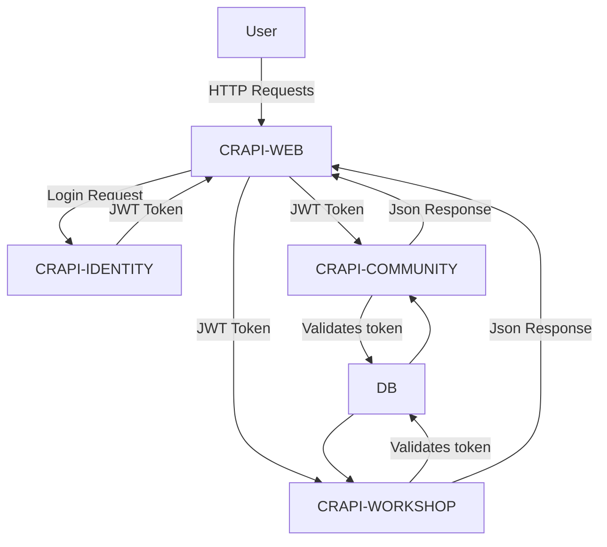

# 🔄 Data Flow Diagram (DFD)

```mermaid
flowchart TD
    U[User] -->|HTTP Requests| crapi-web[CRAPI-WEB]
    crapi-web -->|Login Request| crapi-identity[CRAPI-IDENTITY]
    crapi-identity -->|JWT Token| crapi-web
    crapi-web -->|JWT Token| crapi-community[CRAPI-COMMUNITY]
    crapi-web -->|JWT Token| crapi-workshop[CRAPI-WORKSHOP]
    crapi-community -->|Validates token| DB
    crapi-workshop -->|Validates token| DB
    DB --> crapi-community
    DB --> crapi-workshop
    crapi-community -->|Json Response| crapi-web
    crapi-workshop -->|Json Response| crapi-web
```
