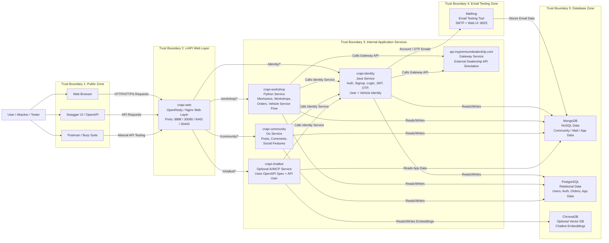

```mermaid
flowchart LR
    %% =========================
    %% External Users / Clients
    %% =========================
    User[User / Attacker / Tester]
    Browser[Web Browser]
    Swagger[Swagger UI / OpenAPI]
    Postman[Postman / Burp Suite]

    User --> Browser
    User --> Swagger
    User --> Postman

    %% =========================
    %% Public Entry Boundary
    %% =========================
    subgraph TB1["Trust Boundary 1: Public Zone"]
        Browser
        Swagger
        Postman
    end

    %% =========================
    %% Edge / Web Layer
    %% =========================
    subgraph TB2["Trust Boundary 2: crAPI Web Layer"]
        Web["crapi-web<br/>OpenResty / Nginx Web Layer<br/>Ports: 8888 / 30080 / 8443 / 30443"]
    end

    Browser -->|HTTP/HTTPS Requests| Web
    Swagger -->|API Requests| Web
    Postman -->|Manual API Testing| Web

    %% =========================
    %% Internal Application Services
    %% =========================
    subgraph TB3["Trust Boundary 3: Internal Application Services"]
        Identity["crapi-identity<br/>Java Service<br/>Auth, Signup, Login, JWT, OTP,<br/>User + Vehicle Identity"]
        Workshop["crapi-workshop<br/>Python Service<br/>Mechanics, Workshops,<br/>Orders, Vehicle Service Flow"]
        Community["crapi-community<br/>Go Service<br/>Posts, Comments,<br/>Social Features"]
        Chatbot["crapi-chatbot<br/>Optional AI/MCP Service<br/>Uses OpenAPI Spec + API User"]
        Gateway["api.mypremiumdealership.com<br/>Gateway Service<br/>External Dealership API Simulation"]
    end

    Web -->|/identity/*| Identity
    Web -->|/workshop/*| Workshop
    Web -->|/community/*| Community
    Web -->|/chatbot/*| Chatbot

    Workshop -->|Calls Identity Service| Identity
    Community -->|Calls Identity Service| Identity
    Chatbot -->|Calls Identity Service| Identity
    Workshop -->|Calls Gateway API| Gateway
    Identity -->|Calls Gateway API| Gateway

    %% =========================
    %% Email / Notification
    %% =========================
    subgraph TB4["Trust Boundary 4: Email Testing Zone"]
        Mailhog["Mailhog<br/>Email Testing Tool<br/>SMTP + Web UI :8025"]
    end

    Identity -->|Account / OTP Emails| Mailhog
    Mailhog -->|Stores Email Data| MongoDB

    %% =========================
    %% Data Layer
    %% =========================
    subgraph TB5["Trust Boundary 5: Database Zone"]
        Postgres["PostgreSQL<br/>Relational Data<br/>Users, Auth, Orders, App Data"]
        MongoDB["MongoDB<br/>NoSQL Data<br/>Community / Mail / App Data"]
        Chroma["ChromaDB<br/>Optional Vector DB<br/>Chatbot Embeddings"]
    end

    Identity -->|Reads/Writes| Postgres
    Identity -->|Reads/Writes| MongoDB
    Workshop -->|Reads/Writes| Postgres
    Workshop -->|Reads/Writes| MongoDB
    Community -->|Reads/Writes| Postgres
    Community -->|Reads/Writes| MongoDB
    Chatbot -->|Reads/Writes Embeddings| Chroma
    Chatbot -->|Reads App Data| MongoDB
```
