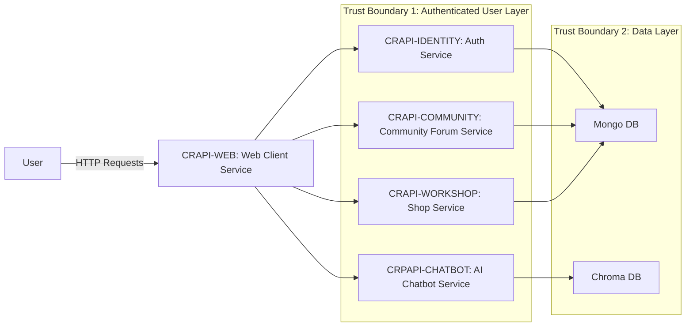

## 🏗️ System Architecture Overview

```mermaid
flowchart LR
    User -->|HTTP Requests| crapi-web[CRAPI-WEB: Web Client Service]
    crapi-web --> crapi-identity[CRAPI-IDENTITY: Auth Service]
    crapi-web --> crapi-community[CRAPI-COMMUNITY: Community Forum Service]
    crapi-web --> crapi-workshop[CRAPI-WORKSHOP: Shop Service]
    crapi-web --> crapi-chatbot[CRPAPI-CHATBOT: AI Chatbot Service]
    crapi-identity --> db[Mongo DB]
    crapi-community --> db[Mongo DB]
    crapi-workshop --> db[Mongo DB]
    crapi-chatbot --> cdb[Chroma DB]

    subgraph Trust Boundary 1: Authenticated User Layer
        crapi-identity
        crapi-community
        crapi-workshop
        crapi-chatbot
    end
    subgraph Trust Boundary 2: Data Layer
        db
        cdb
    end
```
