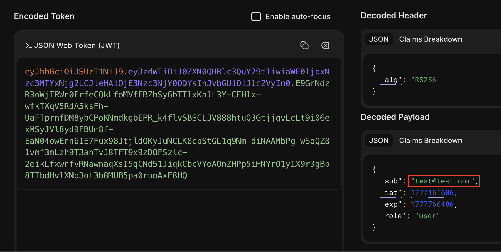
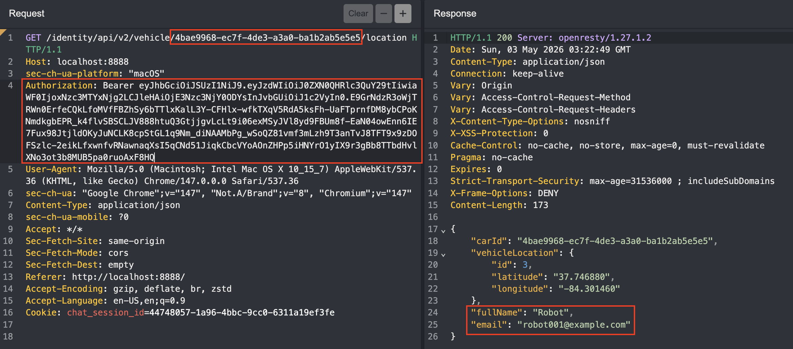

# CR01: Vehicle Location IDOR  

## CVSS Severity
Medium (5.0)

AV:N/AC:L/PR:L/UI:N/S:C/C:L/I:N/A:N

## Affected Endpoint
1. `GET /vehicle/[VEHICLE_ID]/location`

## Impact
The application returns a vehicle's location without checking object authorization or data ownership. This means an attacker can retrieve the location of any vehicle given their UUID, which violates the confidentiality of sensitive user information.

## Root Cause
The `getVehicleLocation` function only takes the vehicle ID as input and does not check whether the requesting user has sufficient rights to the data. Since no authorization validation is in place, any user can request a vehicle's location given the vehicle ID.

## Evidence
See:
- 
- 

## Remediation

In order to properly and elegantly address the vehicle location IDOR vulnerability, changes needed to be made to many different files. This involved restructuring some functions to take extra inputs, such as the requesting user's ID, to verify that the requesting user is the owner of the vehicle before returning its location. 

This involved refactoring the following files:
- [VehicleController.java](../remediations/CR01/VehicleController.java.md): receive the HTTP request as an extra input, validate the JWT token, extract the user ID from it, and pass it along to the `getVehicleLocation` function.
- [VehicleDetailsRepository.java](../remediations/CR01/VehicleDetailsRepository.java.md): adding a function to search for vehicles given the vehicle ID and owner ID.
- [VehicleService.java](../remediations/CR01/VehicleService.java.md): update the interface for the `getVehicleLocation` function to take the requesting user's ID as an argument.
- [VehicleServiceImpl.java](../remediations/CR01/VehicleServiceImpl.java.md): update the vehicle search function to search by the car ID and requesting user ID.
- [VehicleServiceImplTest.java](../remediations/CR01/VehicleServiceImplTest.java.md): update the unit tests with the new functions.
 

## Retest Result
Vehicle ownership is checked before vehicle location retrieval. Therefore, one can only get the location of their own vehicles. 

## OWASP API1 2023: Broken Object Level Authorization
