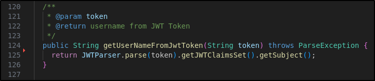
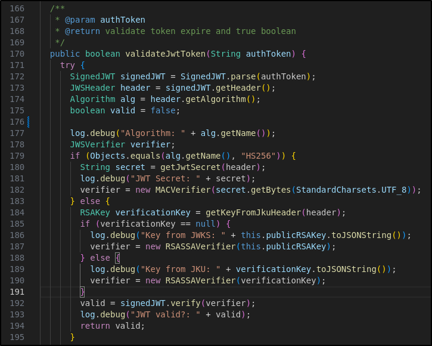

# CR02: Improper JWT Token Validation

The application uses JWT tokens to authenticate and authorize users. However, the application does not properly validate tokens in 2 ways. First, it retrieves user information from JWT payloads without first verifying the signature, which guarantees the integrity of the information. Second, an unsigned token is accepted as a valid token even without a signature.

These 2 findings fall under the OWASP API Top 10: Broken Authentication category. 

## CVSS Severity
Medium (5.0)

AV:N/AC:L/PR:L/UI:N/S:C/C:L/I:N/A:N

## Affected Endpoint
1. Any endpoint that utilizes JWT authentication will be affected

## Impact
An attacker can potentially impersonate as any user, even allowing administrator-level authentication and authorization. This gives attackers full control of the application and all the user data in it. 

## Root Cause
The JWT Provider code mishandles tokens. It retrieves usernames without first verifying the signature and validates tokens without enforcing strict hashing algorithms for the signature.

Screenshots:
1. 
2. 

## Evidence
Screenshots for no signature JWT token
1. evidence/screenshots/sql-injection-before.png
2. evidence/manual-tests/sql-injection-curl-before.md

## Remediation
Create a separate model for post authors, one that only gives the necessary information on Post retrievals. Then, change the Author object to the Post Author object in the Post model.

## Retest Result
Retrieving community posts no longer leaks the author's email and vehicleID. 

## OWASP API2 2023: Broken Authentication

