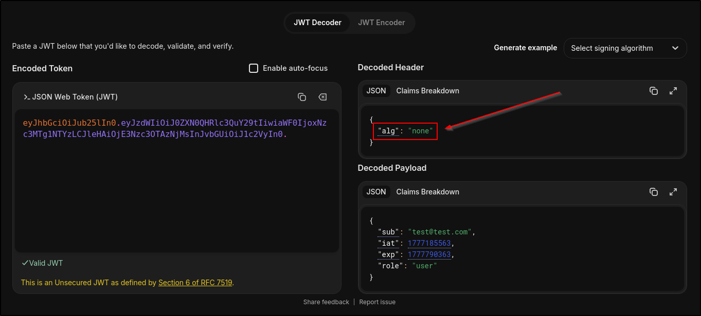
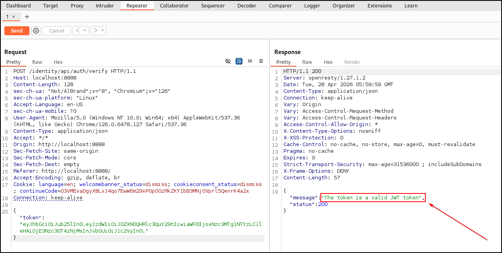
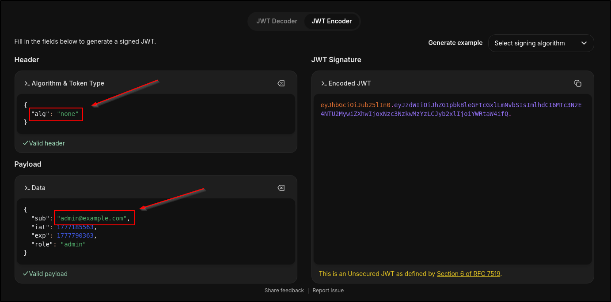
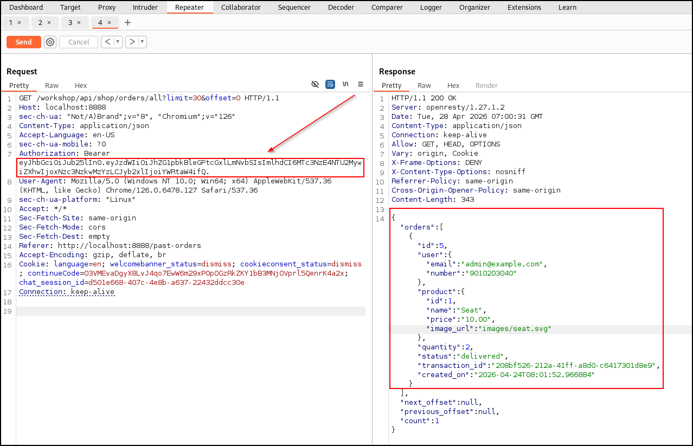
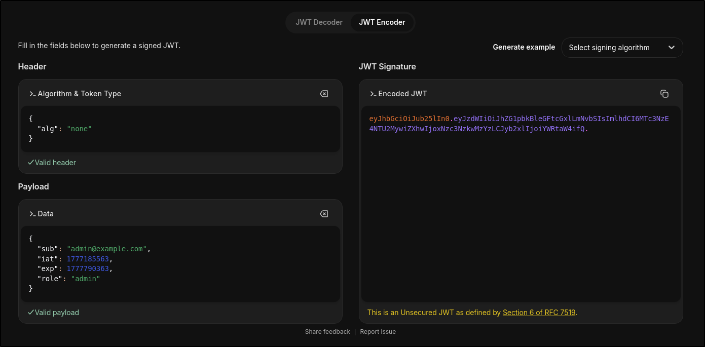
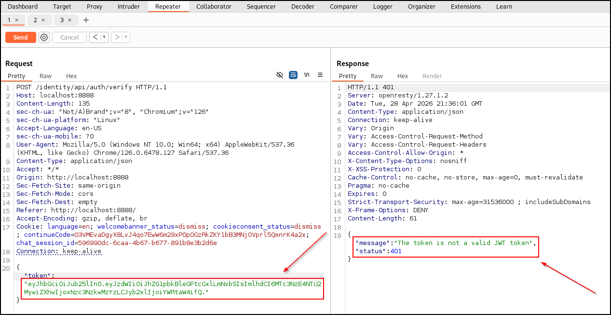
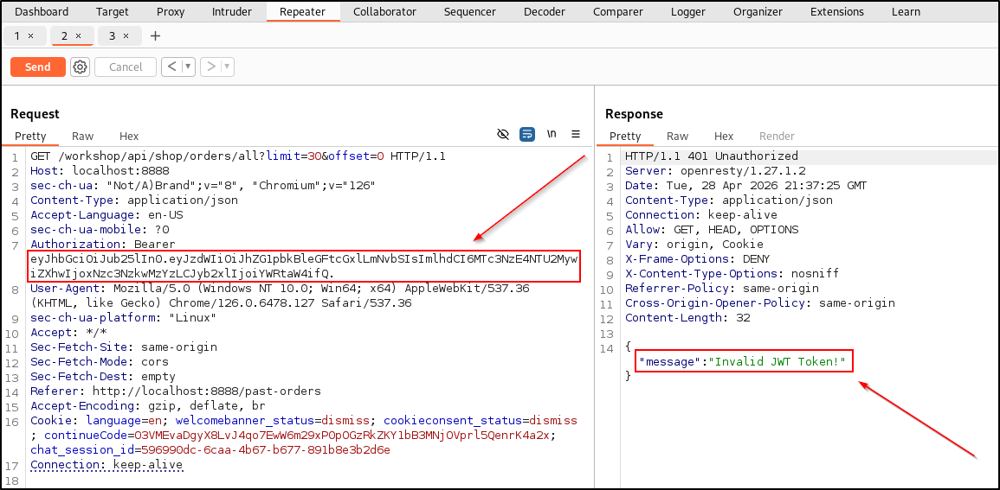

# CR02: Improper JWT Token Validation

The application uses JWT tokens to authenticate and authorize users. However, the application does not properly validate tokens in 2 ways. First, it retrieves user information from JWT payloads without first verifying the signature, which guarantees the integrity of the information. Second, an unsigned token is accepted as a valid token even without a signature.

These 2 findings fall under the OWASP API Top 10: Broken Authentication category. 

## CVSS Severity
Critical (9.9)

AV:N/AC:L/PR:L/UI:N/S:C/C:H/I:H/A:L

## Affected Endpoint
1. Any endpoint that utilizes JWT authentication will be affected

## Impact
An attacker can potentially impersonate as any user, even allowing administrator-level authentication and authorization. This gives attackers full control of the application and all the user data in it. 

## Root Cause
The JWT Provider code mishandles tokens. It retrieves usernames without first verifying the signature and validates tokens without enforcing strict hashing algorithms for the signature.

Screenshots:
1. 
2. 

## Evidence

Screenshots:

1. Setting no signature JWT token still gives valid token response

2. Impersonate admin user with forged JWT token

## Remediation
We will make 2 code remediations. One is to enforce a secure algorithm, such as RS256. The other is to verify the token signature before using any data from the payload, such as the username. 

1. Forge admin user token without signature

2. Token validation failed due to no RS256 signature

3. Token is validated before retrieving username

## Retest Result
JWT tokens are now properly validated. RS256 algorithm is now enforced, tokens are invalidated without signatures, and tokens are properly validated before returning the username. 

## OWASP API2 2023: Broken Authentication

Broken authentication addresses the impersonation problem in cybersecurity and comes in at number 2 on the OWASP API Top 10. API2 2023 relates to Spoofing and Escalation of Privileges in the STRIDE threat modeling framework.
