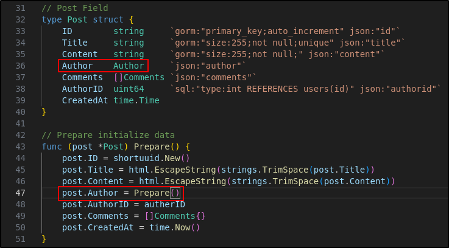
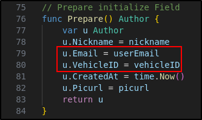
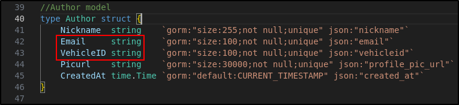
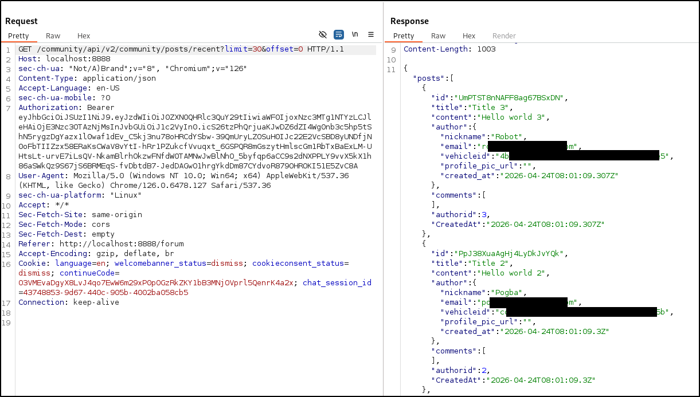
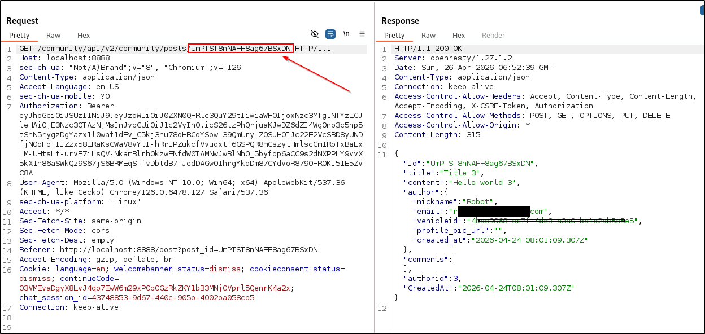

# CR03: Excessive Data Leakage on Community Post

The Post model includes a nested Author object field, which populates the email and vehicleID fields as well. This leaks the post author's sensitive data on every post retrieval. The unauthorized retrieval or modification of an object's field is number 3 on the OWASP API Top 10. 

## CVSS Severity
Medium (5.0)

AV:N/AC:L/PR:L/UI:N/S:C/C:L/I:N/A:N

## Affected Endpoint
1. `GET /community/api/v2/community/posts/[POST_ID]`
2. `GET /community/api/v2/community/posts/recent`

## Impact
An attacker could view user emails and vehicle IDs, which can be leveraged when chaining with other vulnerabilities for higher impact. This vulnerability violates the Confidentiality part of the CIA triad and is an example of Information Disclosure from the STRIDE threat modeling framework. 

## Root Cause
The Post model nests an Author object inside, which includes sensitive information such as their email and vehicleID.

Screenshots:
1. 
2. 
3. 

## Evidence
See:
- 
- 

## Remediation
Create a separate model for post authors, one that only gives the necessary information on Post retrievals. Then, change the Author object to the Post Author object in the Post model.

## Retest Result
Retrieving community posts no longer leaks the author's email and vehicleID. 

## OWASP API3 2023: Broken Object Property Level Authorization

API3 2023: Broken Object Property Level Authorization (BOPLA) is often confused with API1 2023: Broken Object Level Authorization (BOLA). The main difference between API3 and API1 is, in terms of data retrieval from databases, API3 is getting the wrong data columns while API1 is getting the wrong row. BOPLA involves getting or modifying unauthorized data fields for the right object. BOLA involves getting the wrong object altogether.

Therefore, since we are getting the right author's data, but also the wrong fields (email and vehicleID), CR03 falls under API3 rather than API1. 
