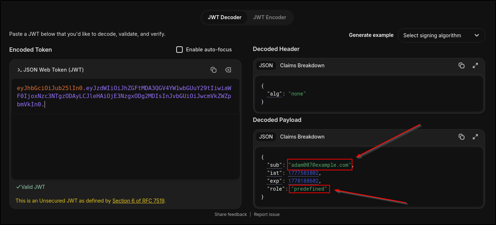
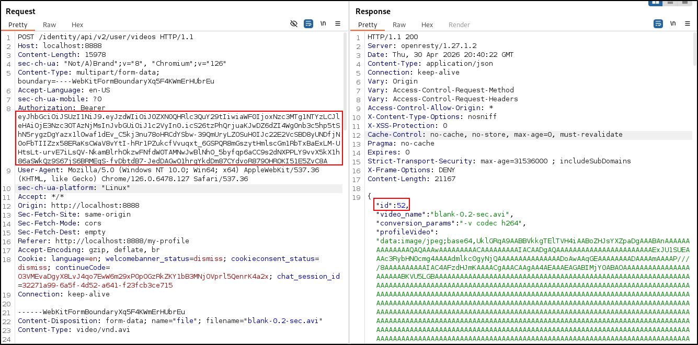

# CR04: Unauthorized Profile Video Deletion

A non-admin user is able to utilize the admin functionality of deleting an arbitrary user's profile video given its video ID number. This should be a functionality reserved only for authorized and admin users.

## CVSS Severity
Medium (5.0)

AV:N/AC:L/PR:L/UI:N/S:C/C:L/I:N/A:N

## Affected Endpoint
1. `DELETE /identity/api/v2/admin/videos/[VIDEO_ID]`

## Impact
Any user can delete the profile video of another user. This goes against proper business flow and is a violation of secure access controls.

## Root Cause
The service implementation code does not validate whether the requesting user has admin access before deleting the profile video. 

## Evidence
See:
- 
- 
- 

## Remediation
Create a separate model for post authors, one that only gives the necessary information on Post retrievals. Then, change the Author object to the Post Author object in the Post model.

## Retest Result
Retrieving community posts no longer leaks the author's email and vehicleID. 

## OWASP API3 2023: Broken Object Property Level Authorization

