# Automated DevSecOps Remediation Pipeline for OWASP crAPI

**Automated dependency remediation and container vulnerability validation pipeline for the crAPI identity service using Renovate, GitHub Actions, Gradle, Docker, and Trivy.**

## Executive Summary

This project demonstrates a realistic DevSecOps workflow: dependency updates are proposed automatically, the affected service is rebuilt from source, the resulting container image is scanned for critical vulnerabilities, and scan evidence is uploaded as a CI artifact.

The pipeline is intentionally scoped to the `crapi-identity` service so it resembles how real teams validate remediation work for a high-risk service instead of running noisy repo-wide scans.

## Pipeline Goal

```text
Developer push / Renovate PR
        ↓
Renovate scans crAPI identity Gradle dependencies
        ↓
Renovate opens grouped remediation PRs
        ↓
GitHub Actions rebuilds crAPI identity image from local source
        ↓
Trivy scans rebuilt image for critical vulnerabilities
        ↓
Text + SARIF evidence is uploaded as workflow artifacts
        ↓
Security gate fails if critical findings remain
```

## Security Skills Demonstrated

| Area | Evidence |
|---|---|
| SCA / Dependency Remediation | Renovate config scoped to Gradle identity dependencies |
| CI/CD Security | GitHub Actions workflow for remediation validation |
| Container Security | Trivy image scanning with CRITICAL severity gate |
| Build Troubleshooting | Gradle/Docker build debugging and test-scope separation |
| Security Evidence | Text and SARIF artifacts for auditability |
| Engineering Judgment | Separation of reporting step from enforcement step |

## Architecture

```mermaid
flowchart LR
    Dev[Developer Push / Renovate PR] --> GH[GitHub Repository]
    GH --> Renovate[Renovate Dependency Scan]
    Renovate --> PR[Grouped Dependency Remediation PR]
    PR --> Actions[GitHub Actions]
    Actions --> Build[Docker Build: crAPI Identity]
    Build --> Image[Local Image: crapi/crapi-identity:SHA]
    Image --> TrivyReport[Trivy Report Scan]
    TrivyReport --> Artifact[Upload TXT + SARIF Evidence]
    Artifact --> Gate[Trivy Critical Vulnerability Gate]
```



## Scope

### Included

- `crapi/services/identity/build.gradle.kts`
- Gradle dependency remediation
- Identity service Docker image build
- Trivy image vulnerability scanning
- CI evidence artifacts

### Excluded

- Full crAPI monorepo dependency updates
- Broad GitHub Actions upgrades
- Unrelated Docker image updates
- Production deployment

This scope is deliberate. A remediation pipeline should be narrow enough that a reviewer can understand exactly what changed and why the validation ran.

## Renovate Design

Renovate was configured to scan only the crapi-identity service Gradle files.

My Renovate config pattern:

```json
{
  "$schema": "https://docs.renovatebot.com/renovate-schema.json",
  "extends": ["config:recommended"],
  "dependencyDashboard": true,
  "enabledManagers": ["gradle", "gradle-wrapper"],
  "includePaths": [
    "appsec-projects/devsecops-security-pipeline-owasp-crapi/crapi/services/identity/build.gradle.kts",
    "appsec-projects/devsecops-security-pipeline-owasp-crapi/crapi/services/identity/settings.gradle.kts",
    "appsec-projects/devsecops-security-pipeline-owasp-crapi/crapi/services/identity/gradle.properties",
    "appsec-projects/devsecops-security-pipeline-owasp-crapi/crapi/services/identity/gradle/wrapper/gradle-wrapper.properties"
  ],
  "labels": ["dependencies", "security", "devsecops", "crapi-identity"],
  "rangeStrategy": "bump"
}
```

## GitHub Actions Design

The workflow does four things:

1. Check out the repository.
2. Build the identity image from local source.
3. Generate Trivy evidence reports without failing early.
4. Enforce a final critical vulnerability gate.

```yaml
name: crAPI Identity Dependency Remediation Validation

on:
  pull_request:
    branches: [main]
    paths:
      - 'appsec-projects/devsecops-security-pipeline-owasp-crapi/crapi/services/identity/**'
      - 'renovate.json'
      - '.github/workflows/devsecops-crapi-identity-remediation.yml'
  push:
    branches: [main]
    paths:
      - 'appsec-projects/devsecops-security-pipeline-owasp-crapi/crapi/services/identity/**'
      - 'renovate.json'
      - '.github/workflows/devsecops-crapi-identity-remediation.yml'
  workflow_dispatch: {}

permissions:
  contents: read
  security-events: write
  actions: read

jobs:
  trivy-identity-image-scan:
    name: Trivy Identity Image Scan
    runs-on: ubuntu-latest

    defaults:
      run:
        working-directory: appsec-projects/devsecops-security-pipeline-owasp-crapi/crapi

    steps:
      - name: Checkout repository
        uses: actions/checkout@v4

      - name: Build crAPI identity image for security scan
        run: |
          docker build \
            --pull \
            --no-cache \
            -f services/identity/Dockerfile.security-scan \
            -t crapi/crapi-identity:${{ github.sha }} \
            services/identity

      - name: Generate Trivy text report
        uses: aquasecurity/trivy-action@0.36.0
        with:
          scan-type: image
          image-ref: crapi/crapi-identity:${{ github.sha }}
          scanners: vuln
          severity: CRITICAL
          ignore-unfixed: true
          format: table
          output: trivy-crapi-identity-critical.txt
          exit-code: '0'

      - name: Generate Trivy SARIF report
        uses: aquasecurity/trivy-action@0.36.0
        with:
          scan-type: image
          image-ref: crapi/crapi-identity:${{ github.sha }}
          scanners: vuln
          severity: CRITICAL
          ignore-unfixed: true
          format: sarif
          output: trivy-crapi-identity-critical.sarif
          exit-code: '0'

      - name: Upload Trivy evidence artifact
        uses: actions/upload-artifact@v4
        if: always()
        with:
          name: trivy-crapi-identity-critical-scan
          path: |
            appsec-projects/devsecops-security-pipeline-owasp-crapi/crapi/trivy-crapi-identity-critical.sarif
            appsec-projects/devsecops-security-pipeline-owasp-crapi/crapi/trivy-crapi-identity-critical.txt

      - name: Enforce critical vulnerability gate
        uses: aquasecurity/trivy-action@0.36.0
        with:
          scan-type: image
          image-ref: crapi/crapi-identity:${{ github.sha }}
          scanners: vuln
          severity: CRITICAL
          ignore-unfixed: true
          format: table
          exit-code: '1'
```

## Docker Build Strategy

The security scan image was built from local source instead of pulling from the official remote source. After updating the dependencies, the inherited unit tests became unstable, prompting me to create a separate Dockerfile for the Trivy container scan only. I used a dedicated scan Dockerfile and kept the unit tests included version in the `devsecops-crapi-security.yml.disabled` file.

```dockerfile
# Dockerfile.security-scan
FROM gradle:8.10.2-jdk17 AS gradlebuild
WORKDIR /app

COPY *.gradle.kts ./
COPY gradle.properties ./
RUN gradle clean build --no-daemon --warning-mode all --stacktrace || true

COPY src src
RUN gradle clean bootJar -x test --no-daemon --warning-mode all --stacktrace

FROM eclipse-temurin:17-noble
RUN apt-get update \
    && apt-get install -y --no-install-recommends curl \
    && apt-get clean \
    && rm -rf /var/lib/apt/lists/*

WORKDIR /app
COPY --from=gradlebuild /app/build/libs/identity-service-1.0-SNAPSHOT.jar /app/identity-service-1.0-SNAPSHOT.jar
COPY jwks.json /app/default_jwks.json
COPY entrypoint.sh /entrypoint.sh
COPY health.sh /app/health.sh

EXPOSE 10001 8080 8989
ENV JAVA_TOOL_OPTIONS="-Xmx128m"
CMD ["/entrypoint.sh"]
```

## Evidence Produced

Expected artifact:

```text
trivy-crapi-identity-critical-scan/
├── trivy-crapi-identity-critical.txt --> /evidence/trivy-crapi-identity-after-remediation.txt
└── trivy-crapi-identity-critical.sarif
```

The text report is human-readable and uploaded to the `/evidence` folder. The SARIF report is machine-readable and can be uploaded to GitHub code scanning or archived for security evidence.

## Troubleshooting Lessons Learned

### Build Failed Before Trivy

Root cause: Dockerfile used `gradle build`, which ran failing inherited unit tests.  
Fix: build `bootJar` for the scan image and track unit tests separately.

### Trivy Exited With Code 1

Root cause: `exit-code: '1'` intentionally fails the job when matching vulnerabilities are found.  
Fix: split reporting from enforcement: generate reports with `exit-code: '0'`, upload artifacts, then run a final gate with `exit-code: '1'`.

### Renovate Scanned Too Broadly

Root cause: Renovate managers and paths were not scoped tightly enough.  
Fix: restrict `enabledManagers` to Gradle and restrict `includePaths` to the identity service Gradle files.

## What This Project Proves

This project shows that I can design and debug a realistic remediation pipeline rather than just run security tools. I scoped dependency updates, rebuilt the affected service, scanned the resulting image, preserved evidence, and separated reporting from enforcement.
